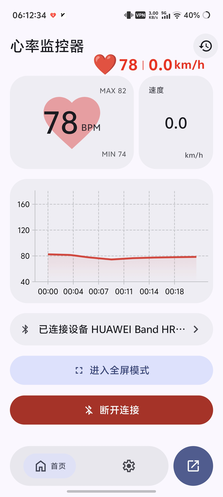
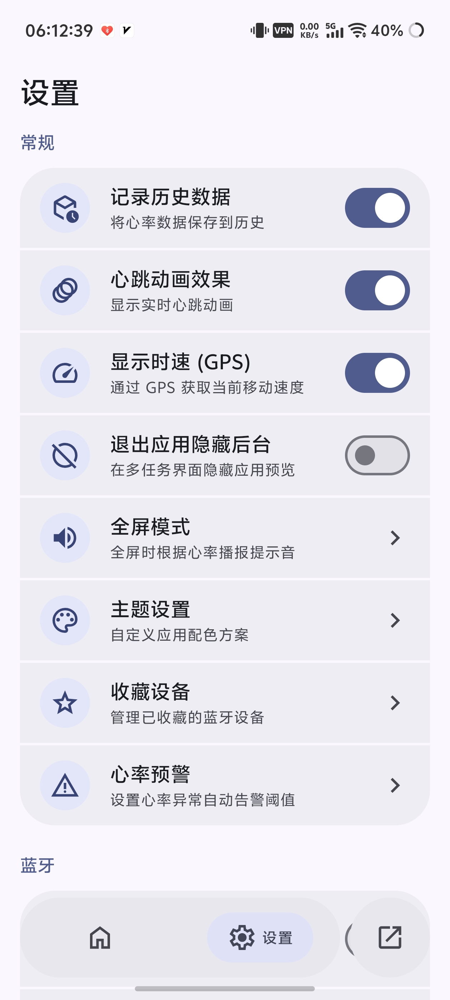
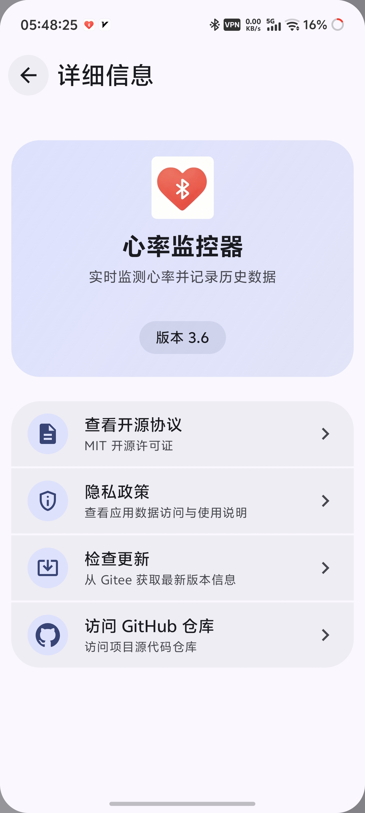
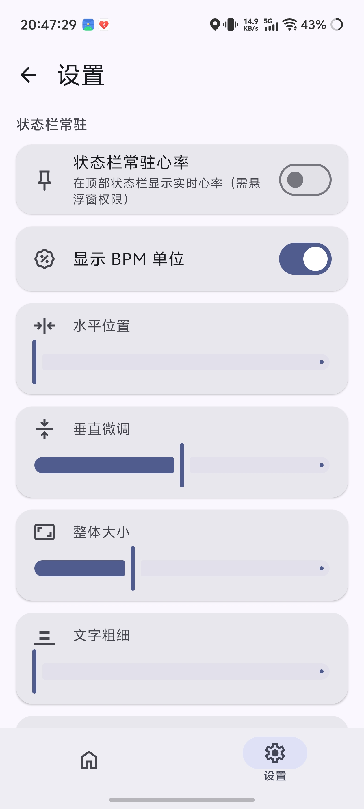
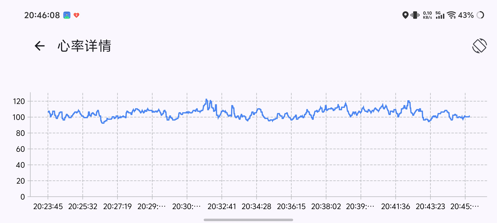

# ❤️ 心率监控器 - HeartRateMonitor


**中文** | [English](README_EN.md)

> 基于 BLE（蓝牙低功耗）技术的 Android 心率监测应用，采用 Material 3 设计规范。

-----

## ✨ 功能特性

- 🔵 **蓝牙连接**：扫描并连接支持心率服务的 BLE 设备
- ⭐ **设备管理**：收藏常用设备，支持自动连接与断开重连
- ❤️ **心跳动画**：根据心率跳动频率动态变化
- 📊 **心率历史与图表**：自动记录、历史列表、批量管理、图表分析、横屏查看
- 🎨 **个性化设置**：功能开关、悬浮窗样式自定义
- 📡 **数据接口**：HTTP 服务器、WebSocket 服务器、Webhook 推送
- 📌 **状态栏常驻心率**：状态栏显示实时心率
- 🔔 **心率预警**：结合姿态检测，心率超限自动通知与震动
- 🧠 **公平运行内存**：适配国产厂商内存管理机制
- 🎨 **颜色选择器**：自绘 HSV 色轮
- ✨ **流畅转场动画** 实时模糊缩放
- 🎯 **Material 3 动态取色**

-----

## 🖼️ 截图展示

<div style="display: flex; justify-content: center; gap: 12px; flex-wrap: wrap;">
  
  
  
  
  
</div>

-----

## 🚀 安装与运行

1. **克隆项目**

    ```bash
    git clone https://github.com/XiaochangXu/HeartRateMonitor-composeui.git
    ```

2. **打开项目**
    - 使用 **Android Studio** 打开项目文件夹
    - 等待 **Gradle** 自动同步依赖

3. **构建并运行**
    - 使用真机或模拟器（API ≥ 27）连接
    - 点击工具栏中的 ▶️ 运行按钮

-----

## 🧭 使用指南

1. **首次权限授予**：允许蓝牙权限与定位权限
2. **连接心率设备**：点击主页扫描按钮，选择设备连接
3. **查看历史记录**：点击工具栏历史图标进入历史列表，单击查看图表
4. **使用悬浮窗**：主页工具栏开关，设置中自定义外观
5. **状态栏常驻**：设置 → 状态栏心率，开启后状态栏显示心率
6. **心率预警**：设置 → 心率预警，配置阈值与姿态校准
7. **数据接口**：设置 → 数据与服务，配置 HTTP/WebSocket/Webhook

-----

## 🙏 致谢

- 图表库：[Vico](https://github.com/patrykandpatrick/vico)
- 蓝牙库：[Kable](https://github.com/JuulLabs/kable)
