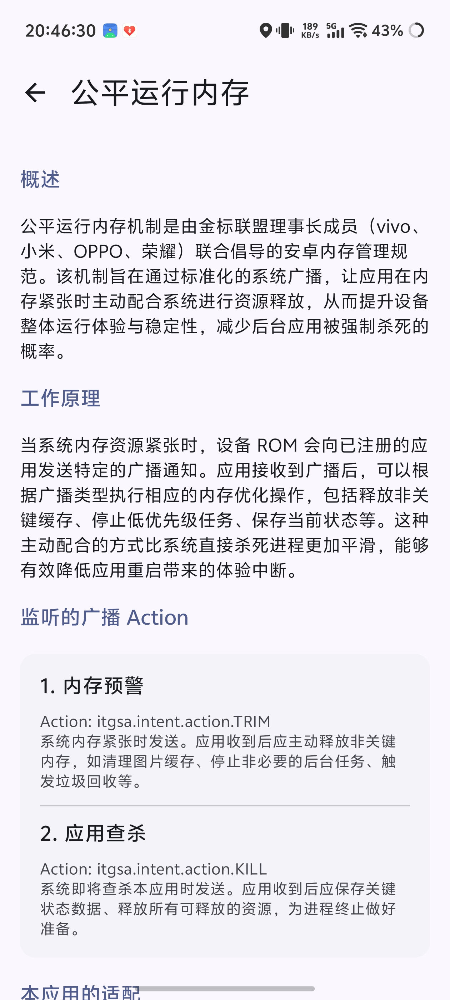

# ❤️ 心率监控器 Compose UI 版 - HeartRateMonitor


> 基于 BLE（蓝牙低功耗）技术的 Android 心率监测应用，采用 **单 Activity ** 架构，遵循 **Material 3** 设计规范。

> 本项目基于 [ccc007ccc/HeartRateMonitorMobile](https://github.com/ccc007ccc/HeartRateMonitorMobile) 大幅度重构修改而来，在此感谢原作者的开源贡献。

-----

## 🔄 与原项目的不同之处

本项目对原项目进行了**重构**与**功能增强**，核心差异如下。

### 📊 总览对比

| 维度 | 原项目 | 本项目（Compose UI 版） |
|------|--------|------------------------|
| 架构 | 多 Activity（8 个）+ XML | 单 Activity + Navigation Compose |
| UI 框架 | XML 布局 + ViewBinding + Compose 混合 | 100% Jetpack Compose |
| 设计语言 | Material Components | Material 3 Expressive |
| 图表库 | MPAndroidChart（基于 View） | Vico（纯 Compose） |
| 颜色选择器 | colorpickerview（第三方库） | Compose Canvas 自绘 HSV 色轮 |
| 包名 | `com.example.heart_rate_monitor_mobile` | `com.github.heartratemonitor_compose` |
| AGP / Gradle | AGP 8.11.2 / Gradle 旧版 | AGP 9.2.1 / Gradle 9.6.1 |
| Kotlin | 2.0.21 | 2.3.10 |
| compileSdk / targetSdk | 35 / 35 | 37 / 37 |
| JVM 版本 | Java 11 | Java 17 |
| 注解处理 | kapt | KSP |
| 版本 | 1.8 (versionCode 6) | 2.0 (versionCode 10) |

### 🏗️ 架构重构

#### 单 Activity 架构
原项目使用 **8 个 Activity**（MainActivity、SettingsActivity、HistoryActivity、ChartActivity、WebhookActivity、ServerActivity、HeartRateAlarmActivity、FavoriteDevicesActivity），本项目重构为**单 Activity + 自管理路由**架构：

- 仅保留 `MainActivity` 作为唯一宿主，所有页面通过 `AppRoot` 内部的三层 overlay 堆栈管理
- **底层**：两个 Tab 页（Home / Settings）常驻，切换时仅动画 `translationX` 偏移，消除 `AnimatedContent` 子组合开销带来的首帧延迟
- **中层**：`NavigationBar` 浮动 overlay，显隐不影响内容区域尺寸
- **顶层**：二级页面覆盖式从底部滑入，使用 GPU `graphicsLayer { translationY }` 合成，零布局开销

#### 删除的 View 体系依赖
- 移除 `appcompat`、`material`（Material Components）、`constraintlayout`
- 移除 `viewBinding`，全部改为 Compose
- 移除所有 `activity_*.xml`、`list_item_*.xml`、`layout_floating_window.xml`、`layout_status_bar_overlay.xml` 等 XML 布局
- 移除 `MPAndroidChart`、`colorpickerview` 第三方依赖

### 🎨 UI / 设计规范

#### Material 3  主题
- 采用 M3  不对称圆角形状（4/8/16/24/28dp）
- 完整的 Surface Container 色调层级（`surfaceContainerLowest` → `surfaceContainerHighest`）
- Android 12+ 动态取色（Monet）由 Compose `dynamicLightColorScheme` / `dynamicDarkColorScheme` 接管，不再依赖 Material Components 的 `DynamicColors` overlay
- 卡片组件统一使用 MD3 标准 `Card`，形状/排版使用 `MaterialTheme` 令牌

#### 流畅的转场动画
- **Tab 切换**（200ms）：横向 slide，常驻页面 + offset 平移，速度连续可中断，无顿挫
- **进入二级页面**（300ms）：从底部滑入覆盖全屏，底层 Tab 页视差上抬 + 缩放 + 实时模糊（API 31+ RenderEffect）
- **返回**（300ms）：二级页面滑出，底层恢复
- **底部导航指示器**：M3 胶囊形状，选中时宽度 32→64dp 动画展开，无长方形 ripple 覆盖


### 📈 图表系统重写

原项目使用 MPAndroidChart（基于 Android View），本项目迁移到 **Vico 3.2.3**（纯 Compose 图表库）

### ➕ 新增功能

#### 公平运行内存机制
适配了金标联盟（vivo、小米、OPPO、荣耀）的系统广播，主动响应内存压力


### ⚡ 性能优化

- **仅 arm64-v8a ABI**：移除 32 位与 x86 兼容，减小 APK 体积
- **代码混淆 + 资源压缩**：release 构建开启 `isMinifyEnabled` + `isShrinkResources`
- **GPU 合成转场**：二级页面用 `graphicsLayer { translationY }` 替代 `slideInVertically`，避免每帧 measure/layout
- **保留调试堆栈**：ProGuard 保留 `SourceFile` / `LineNumberTable`，崩溃日志可读
- **KSP 替代 kapt**：Room 编译器改用 KSP，构建速度更快

-----

## ✨ 功能特性

### 沿用原项目的核心功能
- 🔵 **蓝牙连接**：扫描并连接支持心率服务的 BLE 设备（Kable 库）
- ⭐ **设备管理**：收藏常用设备，支持自动连接与断开重连
- ❤️ **心跳动画**：根据心率跳动频率动态变化
- 📊 **心率历史与图表分析**：自动记录、历史列表、批量管理、深度图表分析、横屏查看
- 🎨 **高度自定义设置**：功能开关、悬浮窗样式（元素/颜色/透明度/圆角/大小）
- 📡 **数据接口**：HTTP 服务器、WebSocket 服务器、Webhook 推送（多预设 + GitHub 同步）

### 本项目新增/增强的功能
- 📌 **状态栏常驻心率**：状态栏叠加层显示实时心率，自动识别背景色切换文字颜色
- 🔔 **心率预警**：结合姿态检测（静坐/站立/运动），心率超限自动通知 + 震动
- 🧠 **公平运行内存**：适配国产厂商内存管理机制，主动响应 TRIM/KILL 广播
- 🎨 **Compose 颜色选择器**：自绘 HSV 色轮，替代第三方依赖
- ✨ **流畅转场动画**：GPU 合成 + 常驻页面架构
- 🎯 **Material 3 Expressive**：完整 M3 设计规范，动态取色支持

-----

## 🖼️ 截图展示

<div style="display: flex; justify-content: center; gap: 12px; flex-wrap: wrap;">
  
  
  
  
  
  
</div>

-----

## �� 安装与运行

1. **克隆项目**

    ```bash
    git clone https://github.com/XiaochangXu/HeartRateMonitor-composeui.git
    ```

2. **打开项目**
    - 使用 **Android Studio** 打开项目文件夹
    - 等待 **Gradle** 自动同步依赖

3. **构建并运行**
    - 使用真机或模拟器（API ≥ 27，建议 arm64-v8a）连接
    - 点击工具栏中的 ▶️ 运行按钮

> 构建环境要求：JDK 17+、AGP 9.2.1、Kotlin 2.3.10

-----

## 🧭 使用指南

1. **首次权限授予**：允许蓝牙权限与定位权限
2. **连接心率设备**：点击主页扫描按钮，选择设备连接
3. **查看历史记录**：点击工具栏历史图标进入历史列表，单击查看图表
4. **使用悬浮窗**：主页工具栏开关，设置中自定义外观
5. **状态栏常驻**：设置 → 状态栏心率，开启后状态栏显示心率
6. **心率预警**：设置 → 心率预警，配置阈值与姿态校准
7. **数据接口**：设置 → 数据与服务，配置 HTTP/WebSocket/Webhook

-----

## 🙏 致谢

- 原项目：[ccc007ccc/HeartRateMonitorMobile](https://github.com/ccc007ccc/HeartRateMonitorMobile)
- 图表库：[Vico](https://github.com/patrykandpatrick/vico)
- 蓝牙库：[Kable](https://github.com/JuulLabs/kable)
