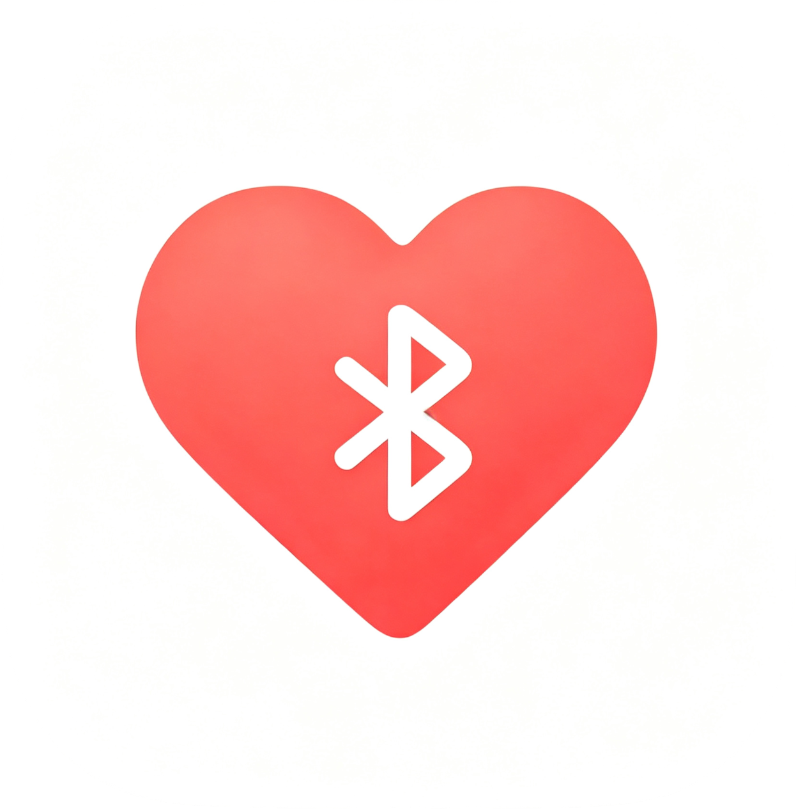
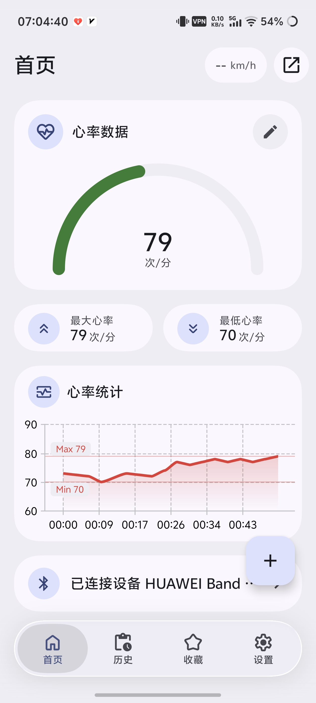
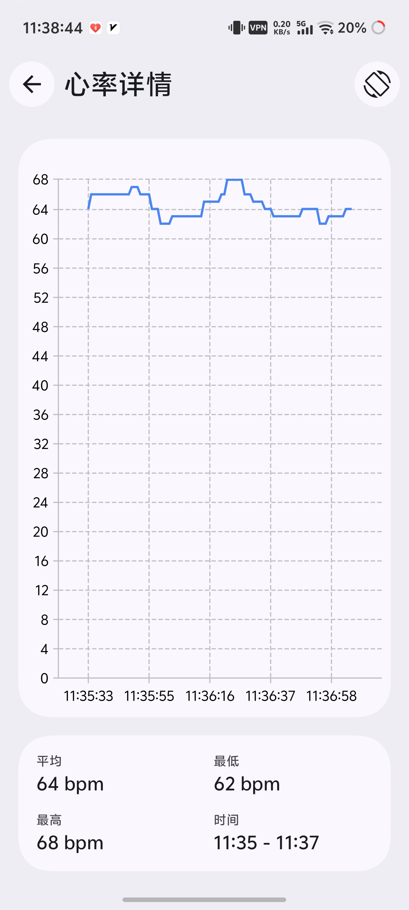
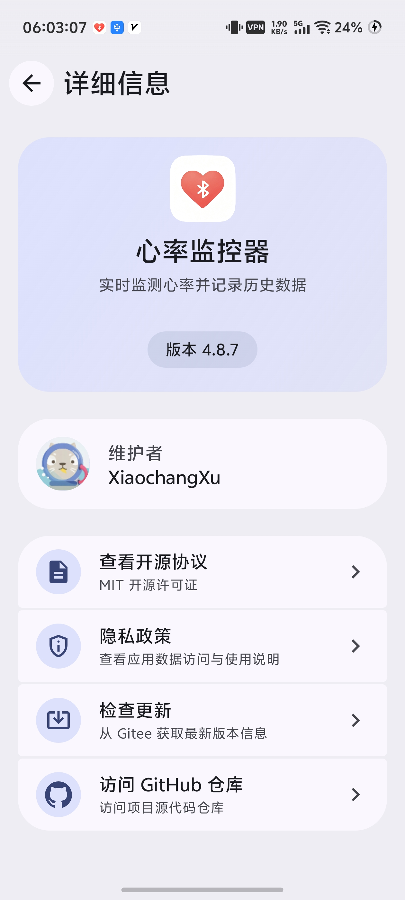
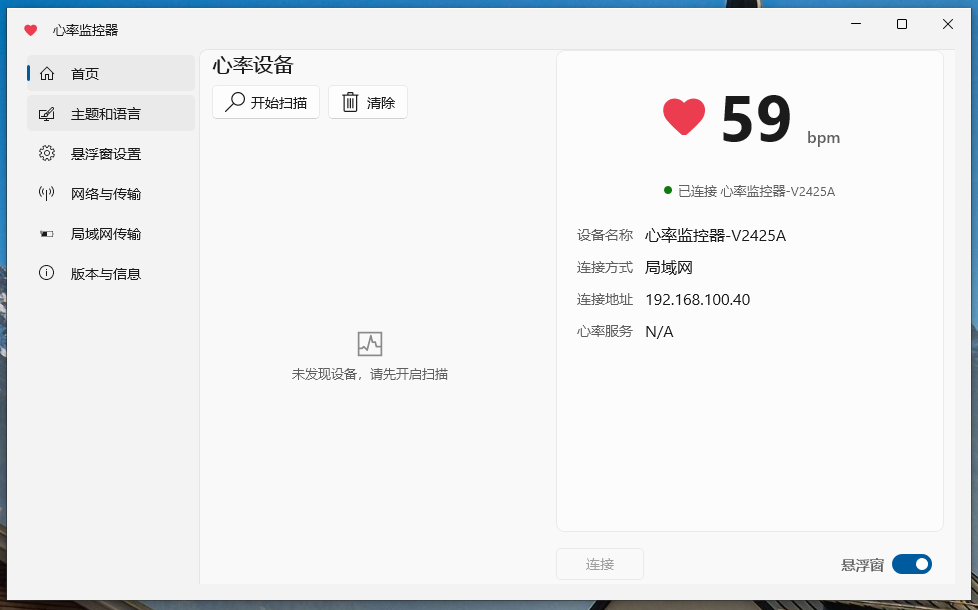

<div align="right">
  <a href="./README_EN.md">English</a> | <strong>简体中文</strong>
  <br>
  <a href="./android/SKILL.md">项目规范</a>
</div>

<div align="center">
  

  <h1>心率监控器 - HeartRateMonitor</h1>

  <p><strong>让心率监测更优雅。</strong></p>

  <p>基于 BLE（蓝牙低功耗）技术的 Android 心率监测应用 + Windows 桌面端心率监控器，双平台可配合使用。</p>

  <p>
    <a href="./LICENSE"></a>
    
    
    
    
    
    
    
    
  </p>
</div>

-----

## 📦 项目概览

本仓库包含两个独立平台的应用，代码互不共享，可配合使用：

| 目录 | 平台 | 技术栈 |
|---|---|---|
| [`android`](./android) | Android | Kotlin + Jetpack Compose |
| [`windows`](./windows) | Windows | .NET 10 + WinUI 3 |

-----

## ✨ 功能特性

### Android 端

- 🖥️ **全屏模式**：沉浸式显示心率数据，让手机成为健康监护仪
- 🔵 **蓝牙连接**：扫描并连接支持心率广播服务的 BLE 设备
- ⭐ **设备管理**：收藏常用设备，支持自动连接与断开重连
- ❤️ **心跳动画**：根据心率跳动频率动态变化
- 📊 **心率历史与图表**：自动记录、历史列表、批量管理、图表分析、横屏查看
- 🎨 **个性化设置**：功能开关、悬浮窗样式自定义
- 📡 **数据接口**：HTTP 服务器、WebSocket 服务器、Webhook 推送
- 🖥️ **OBS 浏览器源心率显示**：内置 HTML 页面，OBS 添加浏览器源填入服务器地址即可实时显示心率，支持自定义颜色、大小、字体等样式参数
- 🖼️ **悬浮窗显示心率**：在手机屏幕上显示心率，不受到应用内容的影响
- 📌 **状态栏常驻心率**：状态栏显示实时心率
- 🔔 **心率预警**：结合姿态检测，心率超限自动通知与震动
- 🧠 **公平运行内存**：适配国产厂商内存管理机制
- 🎨 **颜色选择器**：自绘 HSV 色轮
- ✨ **流畅转场动画** 实时模糊缩放
- 🧊 **液态玻璃效果** 实现底部导航栏的液态玻璃效果
- 🔗 **局域网传输** 通过 WebSocket 服务器实现 PC 端与手机的通信
- 🎯 **Material 3 动态取色**

### Windows 端

- **蓝牙心率监测**：扫描并连接蓝牙心率设备，实时显示 bpm
- **悬浮窗**：可拖拽的桌面悬浮爱心，支持缩放、颜色、心跳动画、bpm 单位显示、触摸穿透与全局热键
- **外观设置**：缩放比例、图标大小、爱心颜色、显示项、心跳动画开关，支持一键重置
- **网络与传输**
  - HTTP 服务器：对外提供当前心率 JSON
  - WebSocket 服务器：实时推送心率数据
  - Webhook：心率变化触发自定义 HTTP 回调
  - 局域网传输：mDNS 广播 + 配对，与手机端实时同步（含端口冲突检测）
- **多语言**：简体中文 / English
- **版本与信息页**：展示当前版本及项目仓库链接

-----

## 🖼️ 截图展示

### Android 端

<table>
  <tr>
    <td align="center"><br/><sub>实时心率监测主页</sub></td>
    <td align="center"><br/><sub>心率历史与图表分析</sub></td>
    <td align="center"><br/><sub>个性化设置与悬浮窗</sub></td>
    <td align="center"><br/><sub>版本与详细信息</sub></td>
   </tr>
</table>

### Windows 端

<p align="center">
  
  <br/><sub>首页</sub>
</p>

-----

## 🚀 安装与运行

克隆仓库：

```bash
git clone https://github.com/XiaochangXu/HeartRateMonitor-composeui.git
```

### Android 端

1. **打开项目**：使用 **Android Studio** 打开 `android` 目录
2. 等待 **Gradle** 自动同步依赖
3. **构建并运行**：使用真机或模拟器（API ≥ 24）连接，点击工具栏中的 ▶️ 运行按钮

### Windows 端

**环境要求**：Windows 10/11、.NET 10 SDK、Windows App SDK 1.8 工作负载。

```bash
cd windows
dotnet build -c Debug
```

运行：

```bash
bin\Debug\net10.0-windows10.0.19041.0\win-x64\HeartRate.exe
```

> 若 `dotnet` 不在 PATH，请使用完整路径调用 `dotnet.exe`。
>
> 也可以直接解压发布包，进入目录双击 `HeartRate.exe` 即可启动。

-----

## 🧭 使用指南

### Android 端

1. **首次权限授予**：允许蓝牙权限与定位权限
2. **连接心率设备**：先在设备上开启心率广播，再点击扫描按钮，选择设备连接
3. **查看历史记录**：点击工具栏历史图标进入历史列表，单击查看图表
4. **使用悬浮窗**：主页工具栏开关，设置中自定义外观
5. **状态栏常驻**：设置 → 状态栏心率，开启后状态栏显示心率
6. **心率预警**：设置 → 心率预警，配置阈值与姿态校准
7. **数据接口**：设置 → 数据与服务，配置 HTTP/WebSocket/Webhook
8. **OBS 心率显示**：开启 HTTP 或 WebSocket 服务器，在 OBS 浏览器源中填入 App 显示的地址（如 `http://<IP>:8001/`），支持 URL 参数自定义样式（`?color=#ff0000&size=80&unit=1`）

### Windows 端

- 解压压缩包后进入目录，双击 `HeartRate.exe` 即可启动

-----

## 技术栈

### Android 端

- Kotlin + Jetpack Compose
- Kable（BLE）、Vico（图表）、Room（数据库）、MaterialKolor（动态取色）
- NanoHTTPD（HTTP/WebSocket 服务）、PermissionX、AndroidLiquidGlass

### Windows 端

- .NET 10 + WinUI 3（Windows App SDK 1.8）
- CommunityToolkit.Mvvm（MVVM 源生成器）
- Direct2D / DirectComposition 渲染悬浮窗
- 自承载（self-contained）非打包部署

-----

## 📁 项目结构

```
├── android/                     # Android 端（Kotlin + Compose，多模块）
│   ├── app/                     # 应用壳：入口、导航、组合根（HeartRateApp @HiltAndroidApp + AppModule）、Manifest
│   ├── core/
│   │   ├── model/               # 领域模型（零依赖）
│   │   ├── designsystem/        # 主题视觉与主题状态（依赖 :data:settings）
│   │   └── ui/                  # 通用 Compose 组件/动画/UI 工具/路由/通用资源
│   ├── data/
│   │   ├── settings/            # DataStore 设置存储 + SettingsRepository
│   │   ├── database/            # Room（Entity/DAO/AppDatabase）
│   │   └── repository/          # 仓储层 + webhook/network/sensor/system
│   ├── service/                 # BLE/常驻/悬浮窗/预警/局域网服务
│   ├── feature/                 # 功能模块：main / settings / history / alarm / server / webhook / favorite
│   ├── baselineprofile/         # 基线配置（com.android.test）
│   ├── SKILL.md                 # 项目规范（含模块边界契约）
│   └── baseline/                # 多模块化基线存档
├── windows/                     # Windows 端（C# + WinUI 3）
├── .github/workflows/           # 发布流水线：release-android.yml / release-windows.yml
├── LICENSE
└── README.md
```

-----

## 🙏 致谢

**核心依赖（Android 端）**

- UI 框架：[Jetpack Compose](https://developer.android.com/jetpack/compose) · [Material 3](https://m3.material.io/)
- 蓝牙：[Kable](https://github.com/JuulLabs/kable)
- 图表：[Vico](https://github.com/patrykandpatrick/vico)
- 数据库：[Room](https://developer.android.com/training/data-storage/room)
- 动态取色：[MaterialKolor](https://github.com/jordond/MaterialKolor)
- HTTP/WebSocket 服务：[NanoHTTPD](https://github.com/NanoHttpd/nanohttpd)
- 权限：[PermissionX](https://github.com/guolindev/PermissionX)
- 液态玻璃：[AndroidLiquidGlass](https://github.com/Kyant0/AndroidLiquidGlass)
- G2圆角：[Capsule](https://github.com/Kyant0/Capsule)

-----

## 🗺️ Roadmap

### ✅ 核心功能

- [x] BLE 心率设备扫描与连接
- [x] 心率历史记录与图表分析
- [x] 悬浮窗 / 状态栏常驻心率
- [x] HTTP / WebSocket / Webhook 数据接口
- [x] OBS 浏览器源心率显示（内置 HTML 页面 + 双模式自动切换）
- [x] 心率预警 + 姿态检测
- [x] Material 3 动态取色
- [x] 自绘 HSV 颜色选择器
- [x] 通过 WebSocket 服务器实现 PC 端与手机的通信

-----

## 📄 License

[MIT](./LICENSE) © 2026 XiaochangXu
