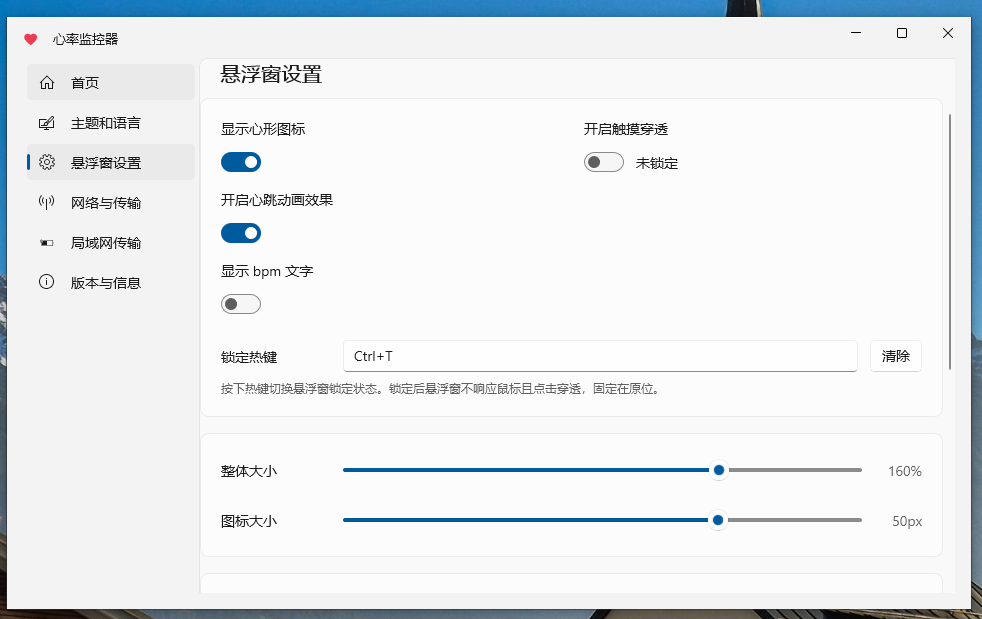
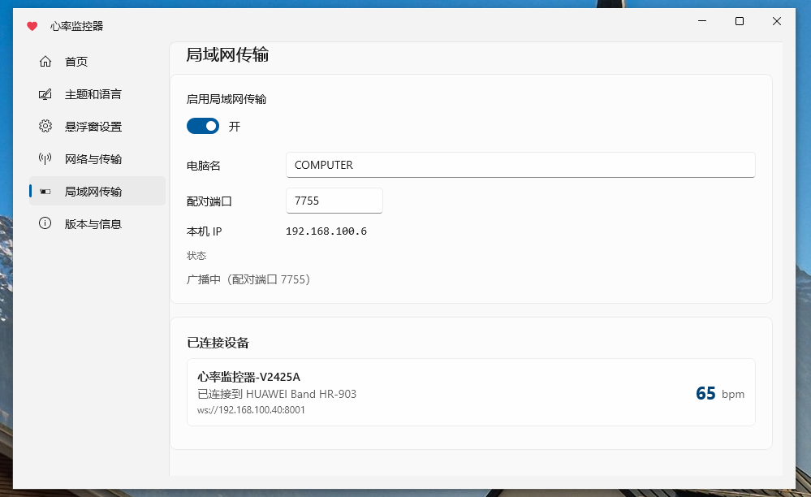
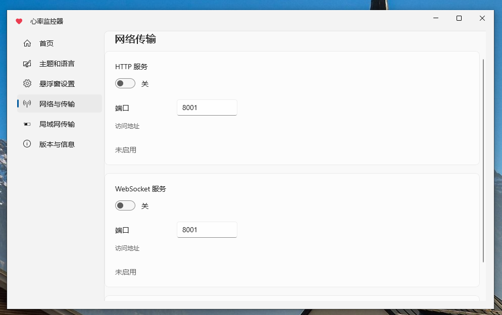
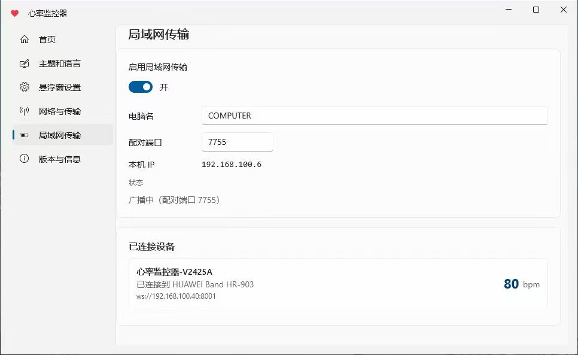

<div align="right">
  <strong>English</strong> | <a href="./README.md">简体中文</a>
  <br>
  <a href="./android/SKILL.md">Project Rules</a>
</div>

<div align="center">
  

  <h1>Heart Rate Monitor</h1>

  <p><strong>Make heart-rate monitoring elegant.</strong></p>

  <p>An Android heart rate monitoring app based on BLE (Bluetooth Low Energy) technology, plus a Windows desktop heart rate monitor — two platforms that work together.</p>

  <p>
    <a href="./LICENSE"></a>
    
    
    
    
    
    
    
    
  </p>
</div>

-----

## 📦 Project Overview

This repository contains two platform-specific applications with no shared code; they can be used together:

| Directory | Platform | Tech Stack |
|---|---|---|
| [`android`](./android) | Android | Kotlin + Jetpack Compose |
| [`windows`](./windows) | Windows | .NET 10 + WinUI 3 |

-----

## ✨ Features

### Android

- 🖥️ **Full-Screen Mode**: Immersive heart rate display, turning your phone into a cardiac monitor
- 🔵 **Bluetooth Connection**: Scan and connect to BLE devices that support heart rate services
- ⭐ **Device Management**: Favorite frequently used devices, with auto-connect and disconnect-reconnect support
- ❤️ **Heartbeat Animation**: Dynamically changes based on heart rate
- 📊 **Heart Rate History & Charts**: Auto-recording, history list, batch management, chart analysis, landscape view
- 🎨 **Personalization**: Feature toggles, floating window style customization
- 📡 **Data Interfaces**: HTTP server, WebSocket server, Webhook push
- 🖥️ **OBS Browser Source Display**: Built-in HTML page — add a browser source in OBS with the server address to display real-time heart rate, with customizable color, size, font, and more via URL parameters
- 🖼️ **Floating Heart Rate Display**: Shows your heart rate over any app on your phone screen
- 📌 **Status Bar Heart Rate**: Display real-time heart rate in the status bar
- 🔔 **Heart Rate Alert**: Posture detection combined with threshold-based notifications and vibration
- 🧠 **Fair Memory Management**: Adapted to domestic vendor memory management mechanisms
- 🎨 **Color Picker**: Self-drawn HSV color wheel
- ✨ **Smooth Transition Animations**: Real-time blur scaling
- 🧊 **Liquid Glass Effect**: Liquid glass effect for the bottom navigation bar
- 🔗 **Local Network Transmission**: WebSocket server for PC and phone communication
- 🎯 **Material 3 Dynamic Color**

### Windows

- **Bluetooth Heart Rate Monitoring**: Scan and connect to Bluetooth heart rate devices, display real-time bpm
- **Floating Window**: A draggable desktop floating heart, with scaling, color, heartbeat animation, bpm unit display, click-through, and global hotkeys
- **Appearance Settings**: Scaling ratio, icon size, heart color, display items, heartbeat animation toggle, one-click reset
- **Network & Transfer**
  - HTTP server: serves current heart rate as JSON
  - WebSocket server: pushes heart rate data in real time
  - Webhook: triggers custom HTTP callbacks on heart rate changes
  - LAN transfer: mDNS broadcast + pairing, real-time sync with the phone (with port conflict detection)
- **Multi-language**: 简体中文 / English
- **Version & Info Page**: Shows current version and repository links

-----

## 🖼️ Screenshots

### Android

<table>
  <tr>
    <td align="center"><br/><sub>Real-time heart rate monitoring</sub></td>
    <td align="center"><br/><sub>History & chart analysis</sub></td>
    <td align="center"><br/><sub>Personalization & floating window</sub></td>
    <td align="center"><br/><sub>About and details</sub></td>
  </tr>
</table>

### Windows

<p align="center">
  
  <br/><sub>Home</sub>
</p>

<p align="center">
  
  <br/><sub>Floating window settings</sub>
</p>

<p align="center">
  
  <br/><sub>LAN transfer</sub>
</p>

<p align="center">
  
  <br/><sub>Version and details</sub>
</p>

<p align="center">
  
  <br/><sub>LAN transfer</sub>
</p>

-----

## 🚀 Installation & Running

Clone the repository:

```bash
git clone https://github.com/XiaochangXu/HeartRateMonitor-composeui.git
```

### Android

1. **Open the project**: Open the `android` directory with **Android Studio**
2. Wait for **Gradle** to automatically sync dependencies
3. **Build and run**: Connect a real device or emulator (API ≥ 24), then click the ▶️ Run button in the toolbar

### Windows

**Requirements**: Windows 10/11, .NET 10 SDK, Windows App SDK 1.8 workload.

```bash
cd windows
dotnet build -c Debug
```

Run:

```bash
bin\Debug\net10.0-windows10.0.19041.0\win-x64\HeartRate.exe
```

> If `dotnet` is not in PATH, call `dotnet.exe` with its full path.
>
> Alternatively, extract the release package and double-click `HeartRate.exe` to launch.

-----

## 🧭 Usage Guide

### Android

1. **Grant permissions**: Allow Bluetooth and location permissions on first launch
2. **Connect a heart rate device**: First enable heart rate broadcasting on the device, then tap the Scan button to select and connect
3. **View history**: Tap the history icon in the toolbar to open the list, then tap an entry to view charts
4. **Use the floating window**: Toggle from the home toolbar, customize appearance in Settings
5. **Status bar persistence**: Settings → Status Bar Heart Rate, enable to show heart rate in the status bar
6. **Heart rate alerts**: Settings → Heart Rate Alert, configure thresholds and posture calibration
7. **Data interfaces**: Settings → Data & Services, configure HTTP/WebSocket/Webhook
8. **OBS heart rate display**: Enable HTTP or WebSocket server, add a browser source in OBS with the address shown in the app (e.g. `http://<IP>:8001/`), customize style via URL params (`?color=#ff0000&size=80&unit=1`)

### Windows

- Extract the release package, enter the directory, and double-click `HeartRate.exe` to launch

-----

## Tech Stack

### Android

- Kotlin + Jetpack Compose
- Kable (BLE), Vico (Charts), Room (Database), MaterialKolor (Dynamic Color)
- NanoHTTPD (HTTP/WebSocket Server), PermissionX, AndroidLiquidGlass

### Windows

- .NET 10 + WinUI 3 (Windows App SDK 1.8)
- CommunityToolkit.Mvvm (MVVM source generators)
- Direct2D / DirectComposition floating window rendering
- Self-contained unpackaged deployment

-----

## 📁 Project Structure

```
├── android/                     # Android (Kotlin + Compose)
├── windows/                     # Windows (C# + WinUI 3)
├── .github/workflows/           # Release pipelines: release-android.yml / release-windows.yml
├── LICENSE
└── README.md
```

-----

## 🙏 Acknowledgements

**Core Dependencies (Android)**

- UI Framework: [Jetpack Compose](https://developer.android.com/jetpack/compose) · [Material 3](https://m3.material.io/)
- Bluetooth: [Kable](https://github.com/JuulLabs/kable)
- Charts: [Vico](https://github.com/patrykandpatrick/vico)
- Database: [Room](https://developer.android.com/training/data-storage/room)
- Dynamic Color: [MaterialKolor](https://github.com/jordond/MaterialKolor)
- HTTP/WebSocket Server: [NanoHTTPD](https://github.com/NanoHttpd/nanohttpd)
- Permissions: [PermissionX](https://github.com/guolindev/PermissionX)
- Liquid Glass: [AndroidLiquidGlass](https://github.com/Kyant0/AndroidLiquidGlass)
- G2 Capsule: [Capsule](https://github.com/Kyant0/Capsule)

-----

## 🗺️ Roadmap

### ✅ Core Features

- [x] BLE heart-rate device scanning & connection
- [x] Heart-rate history & chart analysis
- [x] Floating window / status-bar persistent heart rate
- [x] HTTP / WebSocket / Webhook data interfaces
- [x] OBS browser source heart rate display (built-in HTML page + dual-mode auto-switching)
- [x] Heart-rate alert + posture detection
- [x] Material 3 dynamic color
- [x] Self-drawn HSV color picker
- [x] WebSocket server for PC and phone communication

-----

## 📄 License

[MIT](./LICENSE) © 2026 XiaochangXu
