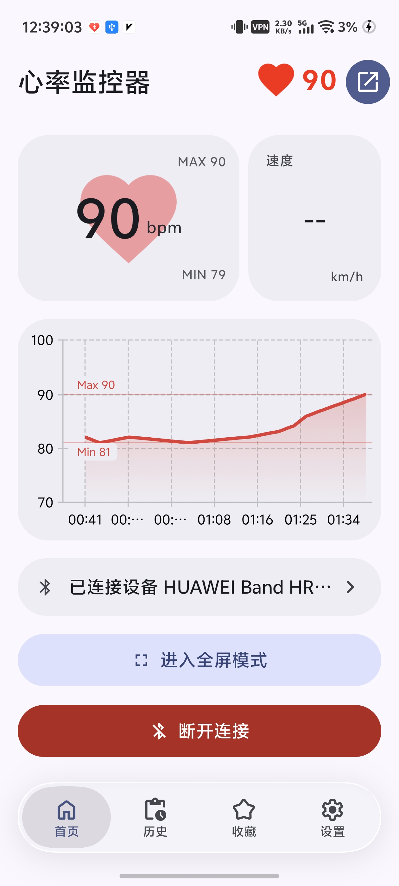
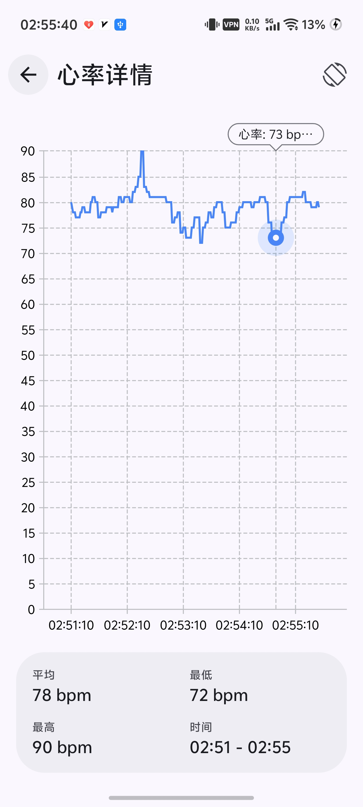
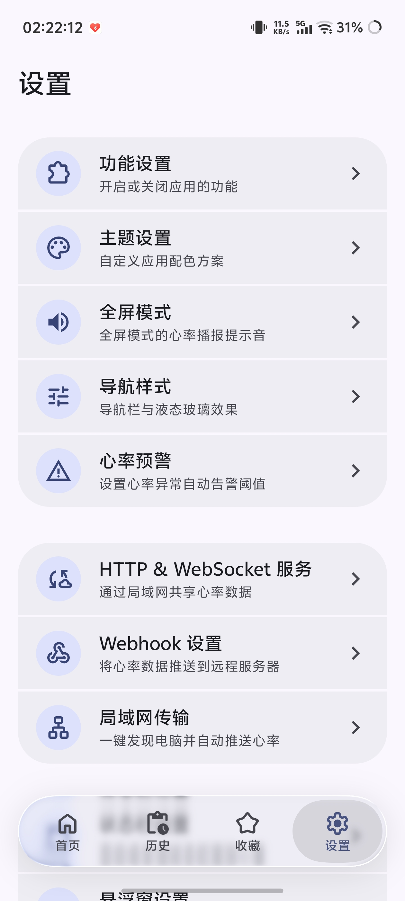
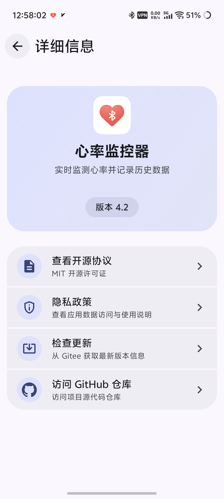

<div align="right">
  <strong>English</strong> | <a href="./README.md">简体中文</a>
</div>

<div align="center">
  

  <h1>❤️ Heart Rate Monitor</h1>

  <p><strong>Make Android heart-rate monitoring elegant.</strong></p>

  <p>An Android heart rate monitoring app based on BLE (Bluetooth Low Energy) technology, following Material 3 design guidelines.</p>

  <p>
    <a href="./LICENSE"></a>
    
    
    
    
    
    
    <a href="https://github.com/XiaochangXu/HeartRateMonitor-composeui/releases/latest"></a>
    <a href="https://github.com/XiaochangXu/HeartRateMonitor-composeui/commits/main"></a>
  </p>
</div>

-----

## ✨ Features

-​ 🖥️ **FullScreen Mode**: Immersive heart rate display, turning your phone into a cardiac monitor
- 🔵 **Bluetooth Connection**: Scan and connect to BLE devices that support heart rate services
- ⭐ **Device Management**: Favorite frequently used devices, with auto-connect and disconnect-reconnect support
- ❤️ **Heartbeat Animation**: Dynamically changes based on heart rate
- 📊 **Heart Rate History & Charts**: Auto-recording, history list, batch management, chart analysis, landscape view
- 🎨 **Personalization**: Feature toggles, floating window style customization
- 📡 **Data Interfaces**: HTTP server, WebSocket server, Webhook push
- 📌 **Status Bar Heart Rate**: Display real-time heart rate in the status bar
- 🔔 **Heart Rate Alert**: Posture detection combined with threshold-based notifications and vibration
- 🧠 **Fair Memory Management**: Adapted to domestic vendor memory management mechanisms
- 🎨 **Color Picker**: Self-drawn HSV color wheel
- ✨ **Smooth Transition Animations** real-time blur scaling
- 🎯 **Material 3 Dynamic Color**

-----

## 🖼️ Screenshots

<table>
  <tr>
    <td align="center"><br/><sub>Real-time heart rate monitoring</sub></td>
    <td align="center"><br/><sub>History & chart analysis</sub></td>
    <td align="center"><br/><sub>Personalization & floating window</sub></td>
    <td align="center"><br/
    ><sub>About and details</sub></td>
  </tr>
</table>

-----

## 🚀 Installation & Running

1. **Clone the project**

    ```bash
    git clone https://github.com/XiaochangXu/HeartRateMonitor-composeui.git
    ```

2. **Open the project**
    - Open the project folder with **Android Studio**
    - Wait for **Gradle** to automatically sync dependencies

3. **Build and run**
    - Connect a real device or emulator (API ≥ 24)
    - Click the ▶️ Run button in the toolbar

-----

## 🧭 Usage Guide

1. **Grant permissions**: Allow Bluetooth and location permissions on first launch
2. **Connect a heart rate device**: Tap the scan button on the home page and select a device
3. **View history**: Tap the history icon in the toolbar to open the list, then tap an entry to view charts
4. **Use the floating window**: Toggle from the home toolbar, customize appearance in Settings
5. **Status bar persistence**: Settings → Status Bar Heart Rate, enable to show heart rate in the status bar
6. **Heart rate alerts**: Settings → Heart Rate Alert, configure thresholds and posture calibration
7. **Data interfaces**: Settings → Data & Services, configure HTTP/WebSocket/Webhook

-----

## 🙏 Acknowledgements

**Core Dependencies**

- UI Framework: [Jetpack Compose](https://developer.android.com/jetpack/compose) · [Material 3](https://m3.material.io/)
- Bluetooth: [Kable](https://github.com/JuulLabs/kable)
- Charts: [Vico](https://github.com/patrykandpatrick/vico)
- Database: [Room](https://developer.android.com/training/data-storage/room)
- Dynamic Color: [MaterialKolor](https://github.com/jordond/MaterialKolor)
- HTTP/WebSocket Server: [NanoHTTPD](https://github.com/NanoHttpd/nanohttpd)
- Permissions: [PermissionX](https://github.com/guolindev/PermissionX)

-----

## 🗺️ Roadmap

### ✅ Core Features

- [x] BLE heart-rate device scanning & connection
- [x] Heart-rate history & chart analysis
- [x] Floating window / status-bar persistent heart rate
- [x] HTTP / WebSocket / Webhook data interfaces
- [x] Heart-rate alert + posture detection
- [x] Material 3 dynamic color
- [x] Self-drawn HSV color picker

-----

## 📄 License

[MIT](./LICENSE) © 2026 XiaochangXu
